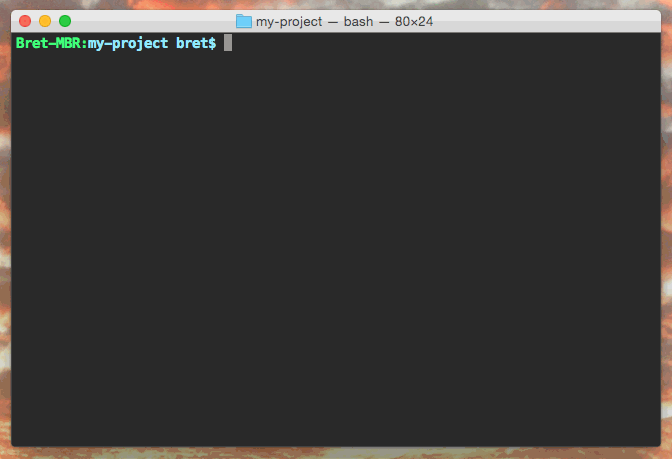

# changelog-init

[![release][release-image]][release-url]
[![npm][npm-image]][npm-url]
[![travis][travis-image]][travis-url]
[![stability][stability-image]][stability-url]

[release-image]: https://img.shields.io/github/release/bcomnes/changelog-init.svg?style=flat-square
[release-url]: https://github.com/bcomnes/changelog-init/releases/latest
[npm-image]: https://img.shields.io/npm/v/changelog-init.svg?style=flat-square
[npm-url]: https://www.npmjs.com/package/changelog-init
[travis-image]: https://img.shields.io/travis/bcomnes/changelog-init.svg?style=flat-square
[travis-url]: https://travis-ci.org/bcomnes/changelog-init
[stability-image]: https://img.shields.io/badge/stability-2%20--%20unstable-yellow.svg?style=flat-square
[stability-url]: https://nodejs.org/api/documentation.html#documentation_stability_index

Creates a [keepachangelog.com](http://keepachangelog.com) changelog in the current directory.  It tries to grab some default values from `package.json` and folder names.



## Install

```
$ npm i changelog-init -g
```

Or use it apart of a larger work flow.

## CLI

```
$ cd project-dir
$ changelog-init
CHANGELOG.md created at /project-dir/CHANGELOG.md
$ cat CHANGELOG.md
# project-dir Change Log
All notable changes to this project will be documented in this file.
This project adheres to [Semantic Versioning](http://semver.org/).

## 2.34.5 - 2015-03-30
* ...
```

`changelog-init` won't overwrite existing changelogs unless you tell it to:

```
$ changelog-init
CHANGELOG.md already exists
$ changelog-init -F
Force overwriting existing changelog
CHANGELOG.md created at /project/CHANGELOG.md
```

You can specify a path as well:

```
$ changelog-init /path/to/project
CHANGELOG.md created at /path/to/project/CHANGELOG.md
```

## API

```js
var init = require('changelog-init')
var opts = {force: false}
init('/path/to/project/', opts, function(err, path) {
  // Stuff
})
```

`init` returns an `error` and a `path` where the CHANGELOG.md was saved.

## See Also

- [changelog-maker](https://github.com/rvagg/changelog-maker)

## References

- https://gist.github.com/ungoldman/476a87abd16cd970bb9f
- http://keepachangelog.com/
- https://github.com/hypermodules/gh-release
- https://github.com/ungoldman/versioneer
- https://github.com/finnp/create-module
- https://github.com/hypermodules/changelog-parser
- https://github.com/ungoldman/module-init
